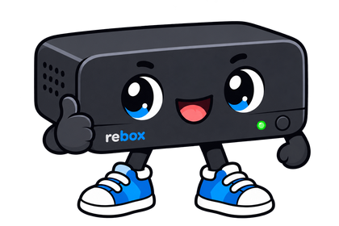

<div align="center">

# ReBox — HR54-700 native media shell




[](LICENSE)

</div>

---

ReBox is a replacement userland shell for the DIRECTV HR54-700. It keeps the useful vendor plumbing — Linux, the Broadcom media stack, HDMI, RF remote support and the existing compositor — and replaces the part I actually care about: what the box does after it boots.

Right now that means a custom native UI, a LAN API, a runtime module system, Jellyfin, IPTV, YouTube, a Frigate viewer, native Doom, and an Android controller. The goal is not to turn the HR54 into a generic Linux PC. The vendor media stack already does the hard hardware-specific work.

> [!WARNING]
> **ReBox is early alpha software.**
>
> This is the current state of an active reverse-engineering project, not a finished appliance image. It has been physically tested on one HR54-700 and the stock installer has been exercised against a cloned stock image, but the portable install path has **not** yet been accepted on a second physical stock receiver.
>
> Expect rough edges, incomplete features, firmware-specific assumptions and things that can regress while this is being worked on. Keep backups. Do not install this on hardware you cannot recover.

## what works right now

- native ReBox Home UI running directly on the receiver
- RF remote input through the ReBox input broker
- runtime module discovery and generic module-driven navigation
- module enable/disable, bundled reinstall, uninstall-with-data-preserved and URL installation
- Jellyfin browsing and playback through the receiver's vendor media path
- IPTV playback from user-supplied M3U playlists when the stream is compatible with the box
- receiver-native YouTube search/extraction/playback using Python, QuickJS, yt-dlp and FFmpeg helpers
- Frigate camera discovery and live playback through the module relay
- pause/resume, replacement playback and stop back to ReBox Home
- native Doom
- Android controller talking directly to the receiver API
- Android runtime module discovery and module management
- local Whisper voice input in the Android controller
- root shell/file-transfer tooling for development and recovery

Doom's sound is **known not to work right now**. Doom itself runs, but the audio path is unfinished/broken. That is a known alpha issue, not a configuration problem you are expected to solve.

Some paths still have limitations. YouTube extraction can break when upstream changes, IPTV is limited by what the receiver can actually decode, Frigate playback expects a compatible H.264/AAC source path, and the Android APK is currently a debug build. The detailed list lives in [Build and limitations](docs/BUILD-AND-LIMITS.md).

## modules

ReBox now has a runtime module architecture instead of baking every provider directly into the shell.

The current bundled **core modules** are:

- Jellyfin
- IPTV
- YouTube
- Frigate
- Doom

Core modules are trusted packages shipped with ReBox. They are discovered at runtime and can be enabled or disabled through the same module-management path used by other modules. Missing bundled modules can be restored from the receiver's trusted offline catalog.

The native UI and Android controller do not need provider-specific Home-screen code. They discover module descriptors and capabilities at runtime and render browsing, search, settings, actions, playback or native-app controls from that contract.

Media modules run out of process and communicate with ReBox core over private Unix sockets. Modules prepare playback plans and provide stream data; ReBox core owns decoder arbitration and the actual vendor `playURL` path. This keeps one provider from owning the receiver's playback lifecycle.

Modules use the `.rbox` package format: a gzip-compressed POSIX ustar archive containing a bounded `module.json` manifest and the module executable/assets. Package installation is staged and transactional, and a newly installed module must pass its health handshake before activation.

Third-party modules can be installed by URL through the management API/UI, but they are **receiver-side native code**, not browser extensions or sandboxed scripts. Only install modules from sources you trust.

The complete API, package format, lifecycle, management authorization and module-development contract are documented in [docs/MODULES.md](docs/MODULES.md).

## what this actually changes

ReBox is not replacement firmware.

Native mode keeps the vendor kernel and media/compositor services, suppresses the stock Druid presentation, restores the vendor RF radio independently, and uses the existing DirectTest/`playURL` path for media.

It does **not**:

- replace the kernel
- flash signed firmware
- factory reset the receiver
- reset remote pairing
- change the receiver's network configuration
- decrypt DIRECTV recordings
- alter subscriber entitlements or conditional access

This project is about repurposing hardware you own or are authorized to modify. It is not a satellite-service bypass.

## supported target

Do not treat "HR54-700" as the whole compatibility check.

The currently supported stock layout is the specific 1 TB HR54-700 build used for this work:

- middleware stack **6840**
- asset-7 manifest minimum **6839**
- genuine cached `7_6932_6932.squashfs`
- exact `/var` partition size: **16,113,320,448 bytes**
- exact realtime partition size: **983,406,247,936 bytes**

The installer and native activation also verify exact hashes from the known vendor build. Unsupported firmware or disk geometry is supposed to fail closed. Do not remove those checks because your box "looks close enough." If you choose to ignore this warning, please report back how it goes!

Model number alone does not establish compatibility.

## installing it

Start with [docs/STOCK-INSTALL.md](docs/STOCK-INSTALL.md). Do not use the historical installation scripts under `source/` as an install guide.

The stock entry path is currently physical:

1. power the receiver down and remove the HDD
2. make an authoritative backup
3. clone the stock `/var` partition image
4. run the ReBox installer against the **clone**
5. write that prepared clone back to partition 2 of the same receiver disk
6. boot stock and verify root/API access
7. run the guarded native activation
8. physically test HDMI, remote input and playback before calling the install good

The helper is intentionally picky about geometry, hashes and what it is allowed to write. That is not an inconvenience to work around. It is there because writing the wrong disk or forcing unknown firmware through the install path would be a very stupid way to test compatibility.

Verify the bundle before doing anything:

```sh
sha256sum -c SHA256SUMS
```

Then read the actual installation document. The summary above is not a substitute for it.

## security

The development access this project installs is powerful and intentionally simple.

The root hook exposes:

- unauthenticated root shell on TCP **5777**
- writable TFTP on UDP **1069**
- ReBox API on TCP **8130**, which is not an authenticated multi-user security boundary

Module-management mutations use pairing/bearer authorization, but that does not turn the existing root shell, TFTP service or LAN API into hardened Internet-facing services. Third-party modules also currently inherit receiver privileges.

The portable hook restricts services to IPv4 loopback/private/link-local source ranges, but another hostile device on the same LAN is still a hostile device.

Use a trusted or isolated LAN/VLAN. Do not port-forward these services to the Internet. Read [docs/SECURITY.md](docs/SECURITY.md) before deploying the box anywhere you do not fully control.

## repo layout

| Path | What is in it |
| --- | --- |
| `android/ReBox-controller.apk` | Current Android controller APK |
| `receiver/payload/hr54-persist/` | Receiver payload, native UI, input broker, API/backend and media runtime assets |
| `source/hr54-re/modules/` | Jellyfin, IPTV, YouTube, Frigate, Doom, shared module support and test module source |
| `source/hr54-re/reboxd/` | ReBox core daemon, module registry/manager, playback arbitration and management API |
| `source/hr54-re/hr54-ui/` | Generic receiver-native UI driven by runtime module descriptors |
| `stock-bootstrap/` | Stock asset-7 boot hook, genuine anchor and big-endian MIPS helper environment |
| `tools/build-module.py` | Build/package helper for `.rbox` modules |
| `tools/build-runtime-bundle.py` | Runtime bundle/catalog builder |
| `tools/prepare-stock-image.sh` | Offline installer for a **cloned** stock `/var` image |
| `tools/activate-native.sh` | Guarded receiver-side native activation |
| `tools/deactivate-native.sh` | Restore the backed-up stock presentation on reboot |
| `tools/recv/` | Root-shell and file-transfer helpers |
| `source/android/` | Android controller source, vendored Whisper code and voice model |
| `SHA256SUMS` | Integrity manifest for the public bundle |

## docs worth reading

- [Module architecture and API](docs/MODULES.md)
- [Stock installation](docs/STOCK-INSTALL.md)
- [Security and privacy](docs/SECURITY.md)
- [Rollback](docs/ROLLBACK.md)
- [Android controller](docs/ANDROID.md)
- [Physical/API acceptance](docs/ACCEPTANCE.md)
- [Build and known limits](docs/BUILD-AND-LIMITS.md)
- [Playback investigation and fixes](docs/PLAYBACK-20261007.md)
- [Package validation](docs/VALIDATION.md)
- [ReBox artwork and smoke background](docs/BRANDING.md)

## current validation boundary

The runtime-module build has been physically exercised on the development HR54-700 with Jellyfin, IPTV, YouTube and Frigate playback working through the receiver's vendor media path. Native navigation, RF input, playback replacement/stop behavior and Doom are also exercised on that receiver.

That does not mean every path has been re-tested after every change. Cold boot behavior, every remote code, every possible upstream media format and every other HR54 firmware revision are not magically proven because one box works.

The portable stock packaging and installer have passed offline checks against a cloned stock image. They still need acceptance on another physical stock receiver.

That is why the badge at the top says **EARLY ALPHA**.
